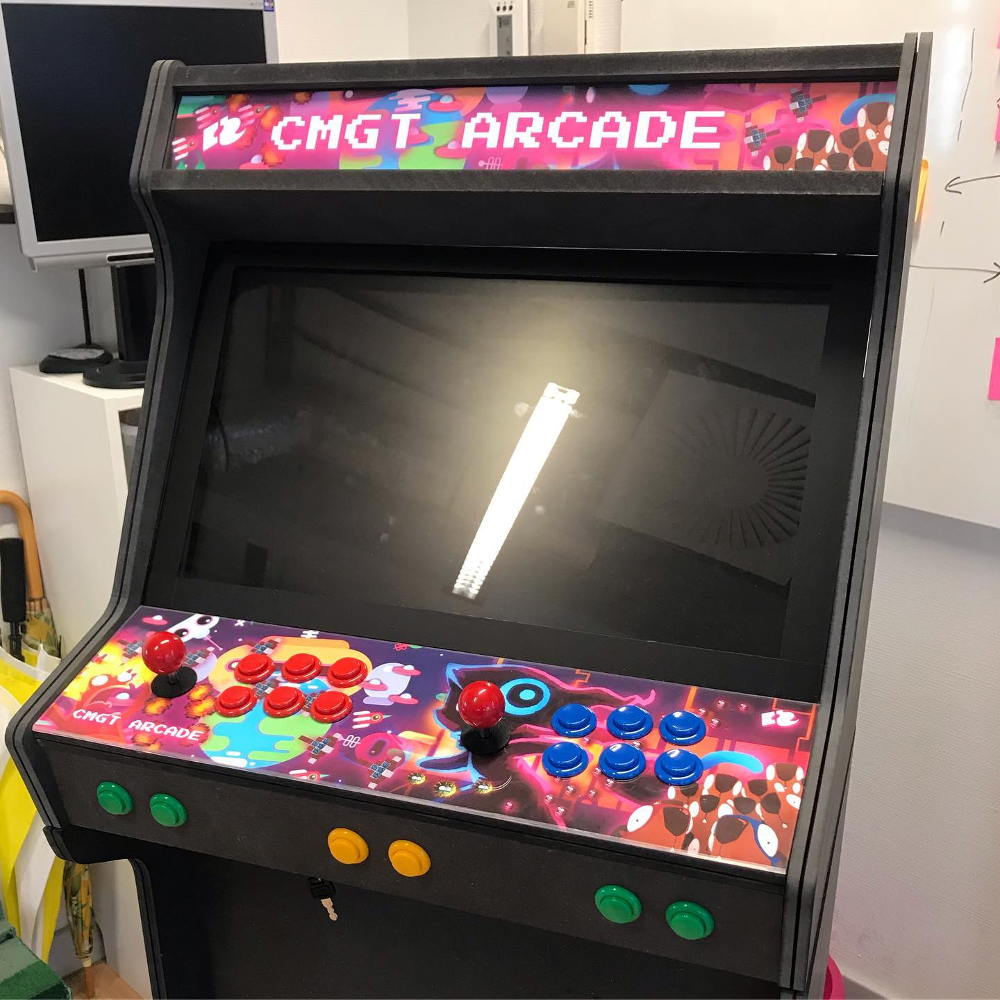

# Simon Says met PixiJS en de CMGT arcade

Dit is een simpel spelletje, wat gebruik maakt van de controllers binnen de Arcade kast van CMGT.

[bron](https://www.instagram.com/p/ByCcVEbBLNv/)

## Gebruik en testen

Om deze 'game' te kunnen spelen of te testen heb je het volgende nodig:
* Een CMGT-controller (deze liggen in de CMGT docentkamer, zolang deze niet zijn uitgeleend)
* Een Playstation controller (deze werken evt. ook met dezelfde library)

Wil je zelf een game maken met de controllers, dan hebben wij hiervoor een library geschreven (niet in te laden via npm): [Arcade Game](https://github.com/HR-CMGT/arcade-game)

## Zelf een game op de arcade kast?

Kijk [hier](https://github.com/HR-CMGT/arcade-server) voor meer informatie.